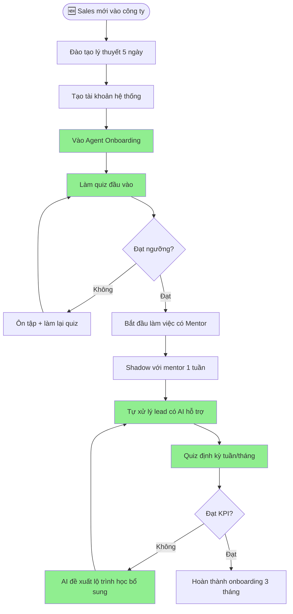
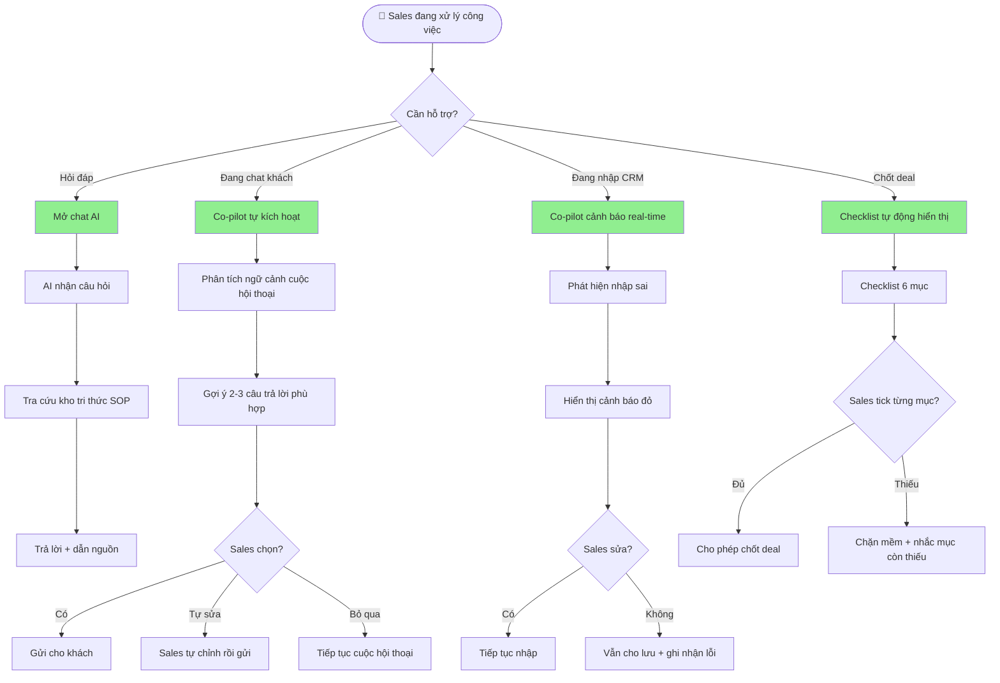
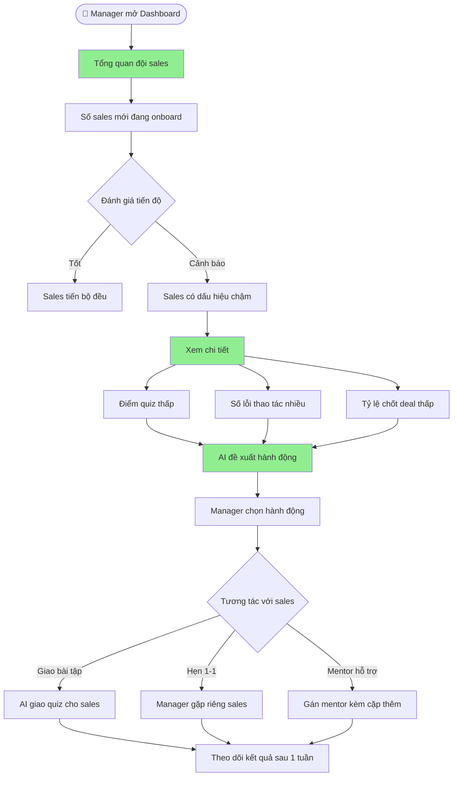

# PRD - Product Requirements Document

## 🎓 Agent Onboarding - Trợ Lý Ảo Cho Nhân Viên Sales Mới

---

## 👤 User Personas

### Persona 1: Sales Mới - Anh Minh (24 tuổi)

```
┌─────────────────────────────────────────────────────────────────┐
│  👤 ANH MINH - Nhân Viên Sales Mới (Tuần thứ 2)                │
├─────────────────────────────────────────────────────────────────┤
│  Tuổi: 24 | Nghề nghiệp: Sinh viên mới ra trường               │
│  Vào VinFast: 2 tuần trước | Đã đào tạo lý thuyết: 5 ngày      │
│  Ca làm: 8h-17h | Đang shadow với mentor                        │
├─────────────────────────────────────────────────────────────────┤
│  🎯 MỤC TIÊU:                                                 │
│  • Hoàn thành 3 tháng onboarding thành công                   │
│  • Tự tin tư vấn khách một mình                                │
│  • Đạt KPI 5 deal/tháng sau 3 tháng                           │
├─────────────────────────────────────────────────────────────────┤
│  😤 ĐIỂM ĐAU:                                                 │
│  • "SOP dài quá, tôi không nhớ hết quy trình 6 bước"         │
│  • "Khách hỏi câu ngoài kịch bản, tôi không biết trả lời"   │
│  • "Tôi không dám hỏi manager vì sợ bị đánh giá kém"         │
│  • "Lỡ tay click nhầm vào CRM, không biết undo"              │
├─────────────────────────────────────────────────────────────────┤
│  😊 KỲ VỌNG:                                                   │
│  • Có AI hỏi đáp 24/7 khi quên quy trình                      │
│  • AI gợi ý câu trả lời khi đang chat với khách               │
│  • Được feedback tự động về chất lượng thao tác                │
└─────────────────────────────────────────────────────────────────┘
```

### Persona 2: Sales Manager - Chị Hoa (35 tuổi)

```
┌─────────────────────────────────────────────────────────────────┐
│  👤 CHỊ HOA - Sales Manager                                    │
├─────────────────────────────────────────────────────────────────┤
│  Tuổi: 35 | Kinh nghiệm: 7 năm quản lý sales                  │
│  Quản lý: 8 sales (3 mới, 5 cũ) | KPI đội: 25 deal/tháng     │
├─────────────────────────────────────────────────────────────────┤
│  🎯 MỤC TIÊU:                                                 │
│  • Sales mới đạt năng suất sớm hơn                            │
│  • Giảm tỷ lệ nghỉ việc trong 3 tháng đầu                     │
│  • Theo dõi tiến độ onboarding của từng người                  │
├─────────────────────────────────────────────────────────────────┤
│  😤 ĐIỂM ĐAU:                                                 │
│  • "Tôi phải dạy lại đi dạy lại nhiều lần cho sales mới"    │
│  • "Không có thời gian theo dõi sát từng người"               │
│  • "Sales mới mắc lỗi cơ bản, ảnh hưởng đến uy tín showroom"│
├─────────────────────────────────────────────────────────────────┤
│  😊 KỲ VỌNG:                                                   │
│  • Dashboard tổng quan tiến độ onboarding của cả đội           │
│  • Cảnh báo sớm khi sales mới có dấu hiệu chậm tiến           │
│  • Tự động giao bài tập/quiz cho sales mới                    │
└─────────────────────────────────────────────────────────────────┘
```

---

## 📖 User Stories

### Nhóm 1: Chat hỏi đáp SOP

```markdown
# US-001: Hỏi quy trình nghiệp vụ
LÀ một nhân viên sales mới,
TÔI MUỐN hỏi AI về quy trình 6 bước (Marketing → CRM → MXH → Tư vấn → Chốt deal → Dashboard),
ĐỂ không phải lục tài liệu dài và tiết kiệm thời gian.

# US-002: Hỏi cách xử lý tình huống
LÀ một nhân viên sales mới,
TÔI MUỐN hỏi AI "Nếu khách yêu cầu giảm giá thêm 5 triệu thì xử lý sao?",
ĐỂ có câu trả lời chuẩn theo SOP của công ty.

# US-003: Tìm kiếm nhanh trong SOP
LÀ một nhân viên sales,
TÔI MUỐN gõ từ khóa (ví dụ: "hợp đồng", "bảo hành") và AI trả về đoạn SOP liên quan,
ĐỂ tra cứu nhanh trong lúc đang làm việc.
```

### Nhóm 2: Co-pilot hỗ trợ real-time

```markdown
# US-004: Gợi ý câu trả lời khi chat với khách
LÀ một nhân viên sales đang inbox tư vấn khách,
TÔI MUỐN AI gợi ý câu trả lời phù hợp với từng giai đoạn (tư vấn xe, đàm phán giá, chốt deal),
ĐỂ không bỏ sót thông tin quan trọng và chuyên nghiệp hơn.

# US-005: Cảnh báo khi nhập CRM sai
LÀ một nhân viên sales đang nhập thông tin khách vào CRM,
TÔI MUỐN AI cảnh báo nếu tôi nhập thiếu trường bắt buộc hoặc sai định dạng,
ĐỂ tránh phải sửa lại sau này.

# US-006: Hướng dẫn checklist khi chốt deal
LÀ một nhân viên sales đang chuẩn bị ký hợp đồng,
TÔI MUỐN AI hiển thị checklist đầy đủ (hợp đồng, cọc, giấy tờ xe cũ, bàn giao),
ĐỂ không bỏ sót bước nào trước khi giao xe.
```

### Nhóm 3: Đánh giá năng lực

```markdown
# US-007: Xem điểm năng lực cá nhân
LÀ một nhân viên sales mới,
TÔI MUỐN xem điểm năng lực của mình theo từng bước (CRM, MXH, Tư vấn, Chốt deal),
ĐỂ biết mình đang mạnh/yếu ở đâu và cần học thêm gì.

# US-008: Làm quiz kiểm tra kiến thức
LÀ một nhân viên sales mới,
TÔI MUỐN làm các bài quiz ngắn theo từng chủ đề (giá xe, chính sách, kịch bản tư vấn),
ĐỂ củng cố kiến thức và tự tin hơn khi gặp khách.

# US-009: Nhận lộ trình học cá nhân hóa
LÀ một nhân viên sales mới,
TÔI MUỐN AI đề xuất lộ trình học tiếp theo dựa trên kết quả quiz và điểm yếu,
ĐỂ học hiệu quả hơn thay vì đọc hết tài liệu.
```

### Nhóm 4: Dashboard cho Manager

```markdown
# US-010: Theo dõi tiến độ onboarding cả đội
LÀ một sales manager,
TÔI MUỐN xem dashboard tổng quan tiến độ onboarding của tất cả sales mới,
ĐỂ biết ai đang tiến bộ tốt, ai cần hỗ trợ thêm.

# US-011: Cảnh báo sớm sales có nguy cơ
LÀ một sales manager,
TÔI MUỐN nhận cảnh báo khi sales mới có dấu hiệu chậm tiến (quiz điểm thấp, thao tác sai nhiều),
ĐỂ kịp thời can thiệp trước khi họ nghỉ việc.
```

---

## 🔧 Core Features (MVP)

### Feature 1: Chat Hỏi Đáp Thông Minh

```
┌────────────────────────────────────────────────────────────┐
│  ✅ Chat tiếng Việt tự nhiên                              │
│  ✅ Tra cứu SOP theo 6 bước nghiệp vụ                    │
│  ✅ Trả lời câu hỏi tình huống cụ thể                     │
│  ✅ Gợi ý câu hỏi liên quan                                │
└────────────────────────────────────────────────────────────┘
```

**Kho tri thức (Knowledge Base):**

| Chủ đề | Nội dung | Nguồn |
|--------|----------|--------|
| Quy trình 6 bước | Marketing → CRM → MXH → Tư vấn → Chốt deal → Dashboard | SOP công ty |
| Giá xe & chính sách | 14 mẫu xe VinFast, giá niêm yết, khuyến mãi | Catalog |
| Kịch bản tư vấn | Các tình huống thường gặp | Playbook |
| Giấy tờ & thủ tục | Checklist hợp đồng, sang tên, bảo hiểm | Quy trình nội bộ |

### Feature 2: Co-pilot Real-time

```
┌────────────────────────────────────────────────────────────┐
│  ✅ Gợi ý câu trả lời khi chat MXH                      │
│  ✅ Cảnh báo khi nhập CRM sai                            │
│  ✅ Checklist tự động khi chốt deal                      │
│  ✅ Highlight thông tin quan trọng trên form              │
└────────────────────────────────────────────────────────────┘
```

### Feature 3: Quiz & Đánh Giá Năng Lực

```
┌────────────────────────────────────────────────────────────┐
│  ✅ 4 bộ quiz: Quy trình / Sản phẩm / Tư vấn / Giấy tờ │
│  ✅ Chấm điểm tự động, hiển thị đáp án đúng/sai        │
│  ✅ Lộ trình học cá nhân hóa theo điểm yếu              │
│  ✅ Lịch sử quiz & tiến bộ theo thời gian                │
└────────────────────────────────────────────────────────────┘
```

### Feature 4: Dashboard Cho Manager

```
┌────────────────────────────────────────────────────────────┐
│  ✅ Tổng quan tiến độ onboarding cả đội                  │
│  ✅ Chi tiết từng sales: điểm quiz, số deal, lỗi thao tác│
│  ✅ Cảnh báo sớm sales có nguy cơ chậm tiến              │
│  ✅ Giao bài tập/quiz cho sales mới                       │
└────────────────────────────────────────────────────────────┘
```

---

## 🔄 Luồng Nghiệp Vụ

### Business Flow 1: Sales Mới Vào Công Ty



### Business Flow 2: Sales Hỏi AI Trong Lúc Làm Việc



### Business Flow 3: Manager Theo Dõi Đội



---

## 📊 Acceptance Criteria

### AC-001: Chat hỏi đáp

| # | Tiêu chí | Ưu tiên |
|---|----------|----------|
| 1 | Sales hỏi "Quy trình chốt deal gồm mấy bước?" → AI trả lời đúng theo SOP | Must have |
| 2 | AI trả lời có dẫn nguồn tài liệu nội bộ | Must have |
| 3 | Thời gian phản hồi < 3 giây | Must have |
| 4 | Gợi ý 3 câu hỏi liên quan sau khi trả lời | Should have |

### AC-002: Co-pilot real-time

| # | Tiêu chí | Ưu tiên |
|---|----------|----------|
| 1 | Khi sales chat khách, AI gợi ý câu trả lời theo giai đoạn (tư vấn/đàm phán/chốt) | Must have |
| 2 | Cảnh báo ngay khi nhập CRM thiếu trường bắt buộc | Must have |
| 3 | Checklist 6 mục tự động hiện khi vào màn hình chốt deal | Must have |

### AC-003: Quiz & Đánh giá

| # | Tiêu chí | Ưu tiên |
|---|----------|----------|
| 1 | 4 bộ quiz (Quy trình / Sản phẩm / Tư vấn / Giấy tờ) | Must have |
| 2 | Chấm điểm tự động, lưu lịch sử | Must have |
| 3 | Đề xuất lộ trình học sau khi quiz | Should have |

### AC-004: Dashboard Manager

| # | Tiêu chí | Ưu tiên |
|---|----------|----------|
| 1 | Xem danh sách sales mới đang onboard | Must have |
| 2 | Điểm tổng quan mỗi người (quiz + thao tác + deal) | Must have |
| 3 | Cảnh báo sales có điểm dưới ngưỡng | Should have |

---

## 🔗 Dependencies

| Dependency | Mô tả | Priority |
|------------|--------|----------|
| OpenAI API | GPT-4o-mini cho chat AI | Critical |
| SOP/Tài liệu nội bộ | Kho tri thức cho AI | Critical |
| CRM System | Tích hợp để theo dõi thao tác | High |
| Database | Lưu lịch sử quiz, điểm năng lực | High |

---

*Document này được tạo cho VinFast K3 Hackathon - Team P182-E403*
