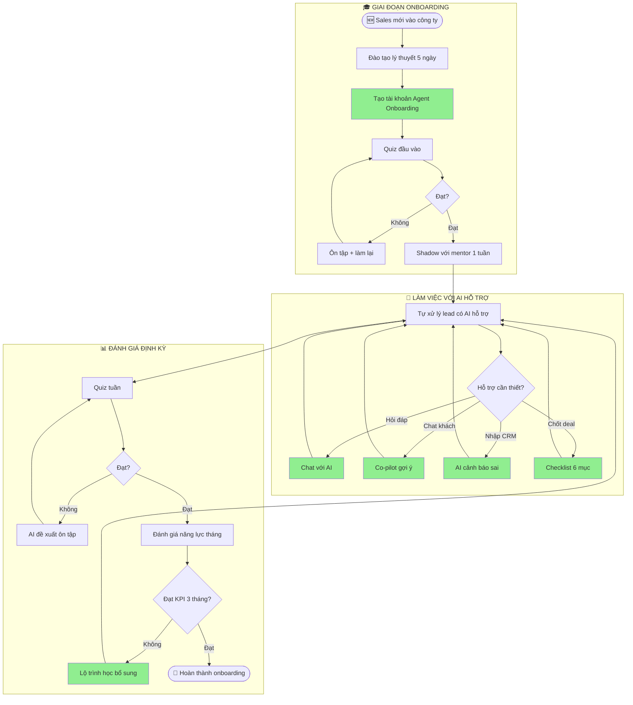
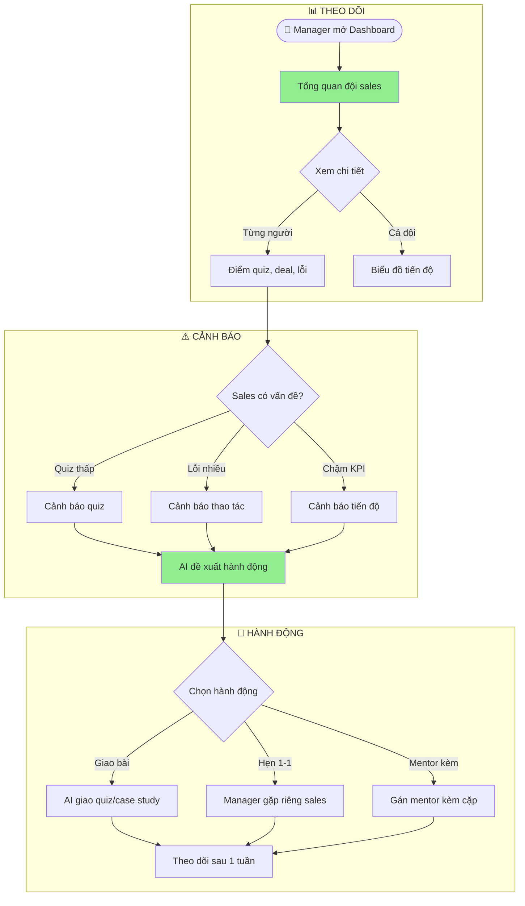

# WIREFRAME & UI FLOW

## 🎓 Agent Onboarding - Trợ Lý Ảo Cho Nhân Viên Sales Mới

---

## 📱 Wireframe Các Màn Hình Chính

### Wireframe 1: Trang Chủ Agent Onboarding (Cho Sales Mới)

```
┌──────────────────────────────────────────────────────────────────────────┐
│  🎓 AGENT ONBOARDING              Xin chào, Minh! (Sales mới - Tuần 2)   │
├──────────────────────────────────────────────────────────────────────────┤
│                                                                          │
│  ┌─────────────────────────────────────────────────────────────────────┐│
│  │                                                                     ││
│  │    👋 CHÀO MỪNG MINH ĐẾN VỚI VINFAST!                             ││
│  │                                                                     ││
│  │    Tiến độ onboarding của bạn:                                      ││
│  │                                                                     ││
│  │    Quy trình 6 bước  ████████░░░░░░  45%                            ││
│  │    Quiz đầu vào     ██████████████  ✅ Đạt (8/10)                  ││
│  │    Quiz tuần 1      ████████░░░░░░  60%                            ││
│  │                                                                     ││
│  └─────────────────────────────────────────────────────────────────────┘│
│                                                                          │
│  ┌──────────────────────────────────────────────────────────────────────┐│
│  │                                                                      ││
│  │   💬 HỎI ĐÁP NGAY                                                 ││
│  │   ┌────────────────────────────────────────────────────────────┐    ││
│  │   │ Ví dụ: "Khách VIP yêu cầu giảm 5 triệu thì xử lý sao?"│    ││
│  │   └────────────────────────────────────────────────────────────┘    ││
│  │   [  Gửi câu hỏi  🚀  ]                                           ││
│  │                                                                      ││
│  │   Câu hỏi gợi ý:                                                  ││
│  │   • Quy trình chốt deal gồm mấy bước?                            ││
│  │   • Các loại giấy tờ cần chuẩn bị khi đổi xe?                   ││
│  │   • Khách phàn nàn giá cao, tôi nên trả lời thế nào?             ││
│  │                                                                      ││
│  └──────────────────────────────────────────────────────────────────────┘│
│                                                                          │
│  ┌──────────────────────┐  ┌──────────────────────┐  ┌────────────────┐│
│  │ 📚 QUY TRÌNH 6 BƯỚC │  │ 📝 QUIZ & ĐÁNH GIÁ  │  │ 🏆 THÀNH TÍCH  ││
│  │                      │  │                      │  │                ││
│  │ 1. Marketing Auto    │  │ • Quy trình (8/10)   │  │ 🥇 Quiz xuất  ││
│  │ 2. CRM chấm điểm     │  │ • Sản phẩm (5/10)   │  │    sắc         ││
│  │ 3. Tương tác MXH     │  │ • Tư vấn (7/10)     │  │ 🎯 3 tuần     ││
│  │ 4. Nuôi dưỡng lead   │  │ • Giấy tờ (chưa làm) │  │    không lỗi  ││
│  │ 5. Tư vấn lái thử    │  │                      │  │                ││
│  │ 6. Chốt deal         │  │ [Làm quiz tiếp →]    │  │ [Xem tất cả →] ││
│  │                      │  │                      │  │                ││
│  │ [Học ngay →]         │  │                      │  │                ││
│  └──────────────────────┘  └──────────────────────┘  └────────────────┘│
│                                                                          │
└──────────────────────────────────────────────────────────────────────────┘
```

---

### Wireframe 2: Chat Hỏi Đáp AI

```
┌──────────────────────────────────────────────────────────────────────────┐
│  💬 HỎI ĐÁP AGENT                                          [← Quay lại] │
├──────────────────────────────────────────────────────────────────────────┤
│                                                                          │
│  ┌─────────────────────────────────────────────────────────────────────┐│
│  │ 🤖 Agent Onboarding                                                 ││
│  │ Chào Minh! Em là trợ lý AI hỗ trợ onboarding của VinFast.           ││
│  │ Anh/chị có câu hỏi gì về quy trình em sẵn sàng hỗ trợ ạ!         ││
│  └─────────────────────────────────────────────────────────────────────┘│
│                                                                          │
│  ┌─────────────────────────────────────────────────────────────────────┐│
│  │ 👤 Minh: Khách VIP yêu cầu giảm giá thêm 5 triệu thì xử lý sao?  ││
│  └─────────────────────────────────────────────────────────────────────┘│
│                                                                          │
│  ┌─────────────────────────────────────────────────────────────────────┐│
│  │ 🤖 Agent Onboarding:                                                ││
│  │                                                                      ││
│  │ Với khách VIP có yêu cầu giảm giá thêm 5 triệu, anh Minh xử lý   ││
│  │ theo 3 bước sau ạ:                                                  ││
│  │                                                                      ││
│  │ **Bước 1: Xác nhận phân khúc khách VIP**                           ││
│  │ - Khách VIP là khách mua ≥ 2 xe hoặc tổng giá trị > 2 tỷ          ││
│  │                                                                      ││
│  │ **Bước 2: Đề xuất giảm giá theo khung**                            ││
│  │ - Khung cho phép: tối đa 3% giá niêm yết (~30-50 triệu)          ││
│  │ - Yêu cầu 5 triệu: NẰM TRONG khung → có thể chấp nhận            ││
│  │                                                                      ││
│  │ **Bước 3: Ghi nhận vào CRM**                                        ││
│  │ - Tick "Đã áp dụng ưu đãi VIP" trong đơn hàng                     ││
│  │ - Chụp biên nhận đính kèm                                          ││
│  │                                                                      ││
│  │ 📖 Nguồn: SOP-BAN-2026-15, mục 4.3.2                              ││
│  │                                                                      ││
│  │ ❓ Câu hỏi liên quan:                                              ││
│  │ • Khách mua 1 xe có được coi là VIP không?                         ││
│  │ • Quy trình duyệt giảm giá cho khách thường?                       ││
│  │ • Làm sao để phân biệt khách VIP và khách VVIP?                    ││
│  └─────────────────────────────────────────────────────────────────────┘│
│                                                                          │
│  ┌─────────────────────────────────────────────────────────────────────┐│
│  │ 👤 Minh: Còn nếu khách yêu cầu giảm 10 triệu thì sao?            ││
│  └─────────────────────────────────────────────────────────────────────┘│
│                                                                          │
│  ┌─────────────────────────────────────────────────────────────────────┐│
│  │ 🤖 Agent Onboarding: (đang soạn...)                                ││
│  └─────────────────────────────────────────────────────────────────────┘│
│                                                                          │
├──────────────────────────────────────────────────────────────────────────┤
│  [Nhập câu hỏi của bạn...]                              [Gửi 🚀]      │
└──────────────────────────────────────────────────────────────────────────┘
```

---

### Wireframe 3: Học Quy Trình 6 Bước

```
┌──────────────────────────────────────────────────────────────────────────┐
│  📚 QUY TRÌNH BÁN HÀNG VINFAST                            [← Quay lại]  │
├──────────────────────────────────────────────────────────────────────────┤
│                                                                          │
│  Bước 1/6 ─── Bước 2 ─── Bước 3 ─── Bước 4 ─── Bước 5 ─── Bước 6     │
│  ✅         ⏳         ⚪         ⚪         ⚪         ⚪                  │
│  Marketing  CRM        MXH       Nuôi      Tư vấn    Chốt                │
│  Auto       Chấm       Tương    dưỡng     lái thử    deal                │
│             điểm       tác      lead                                      │
│                                                                          │
│  ─────────────────────────────────────────────────────────────────────  │
│                                                                          │
│  📍 BƯỚC 2: CRM - CHẤM ĐIỂM LEAD                                     │
│                                                                          │
│  ⏱️ Thời gian học: 20 phút │ 📊 Độ khó: Trung bình                   │
│                                                                          │
│  ┌─────────────────────────────────────────────────────────────────────┐│
│  │                                                                      ││
│  │  🎯 MỤC TIÊU                                                       ││
│  │  Sau bài học này, bạn sẽ biết cách chấm điểm lead để phân loại     ││
│  │  khách hàng tiềm năng (nóng/lạnh/ấm) chính xác.                    ││
│  │                                                                      ││
│  │  📖 NỘI DUNG                                                        ││
│  │  1. Lead nóng là gì? Đặc điểm nhận biết                           ││
│  │     • Đã để lại SĐT, có nhu cầu lái thử trong 7 ngày             ││
│  │     • Đã tương tác ≥ 3 lần (comment, inbox, gọi)                  ││
│  │     • Có xe cũ muốn đổi                                            ││
│  │                                                                      ││
│  │  2. Tiêu chí chấm điểm (thang 100 điểm)                          ││
│  │     ┌──────────────┬─────────┬────────────┐                        ││
│  │     │ Tiêu chí     │ Điểm    │ Phân loại  │                        ││
│  │     ├──────────────┼─────────┼────────────┤                        ││
│  │     │ Có SĐT       │ +20     │ Bắt buộc   │                        ││
│  │     │ Nhu cầu rõ   │ +30     │ Nóng/Ấm    │                        ││
│  │     │ Tương tác ≥3 │ +20     │ Nóng       │                        ││
│  │     │ Ngân sách rõ │ +20     │ Ấm         │                        ││
│  │     │ Có xe đổi    │ +10     │ Nóng       │                        ││
│  │     └──────────────┴─────────┴────────────┘                        ││
│  │                                                                      ││
│  │  3. Phân loại                                                       ││
│  │     🔥 Nóng (≥80 điểm): Liên hệ ngay trong 2 giờ                 ││
│  │     🌡️ Ấm (50-79): Nuôi dưỡng bằng tin nhắn/Zalo                  ││
│  │     ❄️ Lạnh (<50): Marketing tự động chăm sóc                      ││
│  │                                                                      ││
│  │  💡 TÌNH HUỐNG THỰC TẾ                                            ││
│  │  ┌──────────────────────────────────────────────────────────────┐   ││
│  │  │ Khách A: Inbox hỏi giá VF 8, để lại SĐT, nói "tuần sau    │   ││
│  │  │ tôi qua showroom xem". Anh chấm bao nhiêu điểm?            │   ││
│  │  │ → Đáp án: 20+30+0+20+0 = 70 điểm → ẤM                     │   ││
│  │  │ → Hành động: Gọi điện xác nhận lịch showroom tuần sau    │   ││
│  │  └──────────────────────────────────────────────────────────────┘   ││
│  │                                                                      ││
│  └─────────────────────────────────────────────────────────────────────┘│
│                                                                          │
│  ┌─────────────────────────────────────────────────────────────────────┐│
│  │  [⬅️ Bài trước]              [✅ Đã hiểu]              [Bài tiếp ➡️]││
│  └─────────────────────────────────────────────────────────────────────┘│
│                                                                          │
└──────────────────────────────────────────────────────────────────────────┘
```

---

### Wireframe 4: Co-pilot Real-time Khi Chat MXH

```
┌──────────────────────────────────────────────────────────────────────────┐
│  💬 Chat với khách hàng: Anh Tuấn (Facebook)                            │
├──────────────────────────────────────────────────────────────────────────┤
│                                                                          │
│  ┌─────────────────────────────────────────────────────────────────────┐│
│  │ 👤 Anh Tuấn: VF 8 có giảm giá gì không shop?                       ││
│  │                                          10:32 AM                   ││
│  └─────────────────────────────────────────────────────────────────────┘│
│                                                                          │
│  ┌─────────────────────────────────────────────────────────────────────┐│
│  │ 👨‍💼 Minh: Dạ VF 8 hiện tại đang có...                               ││
│  └─────────────────────────────────────────────────────────────────────┘│
│                                                                          │
│  ┌─────────────────────────────────────────────────────────────────────┐│
│  │ 👤 Anh Tuấn: Tôi muốn đổi xe cũ lấy VF 8 có được không?          ││
│  │                                          10:33 AM                   ││
│  └─────────────────────────────────────────────────────────────────────┘│
│                                                                          │
│  ┌─────────────────────────────────────────────────────────────────────┐│
│  │ 🤖 CO-PILOT GỢI Ý (Giai đoạn: Tư vấn - Đổi xe)                  ││
│  │                                                                      ││
│  │ ┌──────────────────────────────────────────────────────────────────┐│
│  │ │  📝 Gợi ý câu trả lời phù hợp:                                  ││
│  │ │                                                                  ││
│  │ │  "Dạ được ạ! VinFast hiện có chương trình đổi xe cũ lấy xe mới  ││
│  │ │   với nhiều ưu đãi hấp dẫn. Anh cho em hỏi:                    ││
│  │ │   1. Anh đang sử dụng dòng xe nào ạ?                            ││
│  │ │   2. Xe đăng ký từ năm nào ạ?                                   ││
│  │ │   3. Anh muốn lái thử VF 8 trước không ạ?"                     ││
│  │ │                                                                  ││
│  │ │   💡 Mẹo: Hỏi 3 câu này giúp phân loại lead nóng (xem SOP-2.1) ││
│  │ └──────────────────────────────────────────────────────────────────┘│
│  │                                                                      ││
│  │ [✏️ Sửa & gửi]    [📤 Gửi nguyên văn]    [❌ Bỏ qua]              ││
│  └─────────────────────────────────────────────────────────────────────┘│
│                                                                          │
│  ┌─────────────────────────────────────────────────────────────────────┐│
│  │ [Nhập tin nhắn...]                                    [Gửi 📤]      ││
│  └─────────────────────────────────────────────────────────────────────┘│
│                                                                          │
└──────────────────────────────────────────────────────────────────────────┘
```

---

### Wireframe 5: Checklist Khi Chốt Deal

```
┌──────────────────────────────────────────────────────────────────────────┐
│  📋 CHECKLIST CHỐT DEAL - Khách: VF-24082 - Lê Quốc Bảo               │
├──────────────────────────────────────────────────────────────────────────┤
│                                                                          │
│  ⚠️ Vui lòng tick đủ 6 mục trước khi cho phép chốt deal              │
│                                                                          │
│  ┌─────────────────────────────────────────────────────────────────────┐│
│  │                                                                      ││
│  │  ☑️ 1. ✅ Hợp đồng mua xe đã ký (2 bản)                          ││
│  │      📎 HD-MuaXe-VF24082-20260801.pdf                              ││
│  │                                                                      ││
│  │  ☑️ 2. ✅ Khách đã đặt cọc tối thiểu 50 triệu                    ││
│  │      💰 Số tiền: 50.000.000đ                                       ││
│  │      📎 UNC-20260801-001.jpg                                        ││
│  │                                                                      ││
│  │  ☐ 3. ⏳ Đã xác nhận thông tin đăng ký xe                         ││
│  │      [Mở form xác nhận →]                                          ││
│  │                                                                      ││
│  │  ☐ 4. ⏳ Đã thu đủ giấy tờ gốc xe cũ (nếu có đổi xe)            ││
│  │      📋 Cần: Đăng ký gốc, Cà vẹt, Bảo hiểm 2 chiều             ││
│  │                                                                      ││
│  │  ☐ 5. ⏳ Đã cập nhật trạng thái khách trên CRM = "Đặt lịch"     ││
│  │      [Mở CRM →]                                                    ││
│  │                                                                      ││
│  │  ☐ 6. ⏳ Đã hẹn ngày giờ bàn giao xe                              ││
│  │      [Chọn ngày 📅]                                                 ││
│  │                                                                      ││
│  └─────────────────────────────────────────────────────────────────────┘│
│                                                                          │
│  ⚠️ CÒN 4 MỤC CHƯA HOÀN THÀNH - Chưa thể chốt deal                    │
│                                                                          │
│  ┌─────────────────────────────────────────────────────────────────────┐│
│  │                                                                      ││
│  │   [⏸️ Tạm dừng - Lưu nháp]                                        ││
│  │                                                                      ││
│  │   [✅ CHỐT DEAL]  (Disabled - chưa đủ 6 mục)                       ││
│  │                                                                      ││
│  └─────────────────────────────────────────────────────────────────────┘│
│                                                                          │
│  💡 Mẹo: Bạn có thể bấm "Tạm dừng - Lưu nháp" và quay lại sau        │
│     khi đã hoàn thành đủ các mục                                       │
└──────────────────────────────────────────────────────────────────────────┘
```

---

### Wireframe 6: Dashboard Cho Manager

```
┌──────────────────────────────────────────────────────────────────────────┐
│  📊 DASHBOARD ONBOARDING - Manager: Chị Hoa              [Đăng xuất]    │
├──────────────────────────────────────────────────────────────────────────┤
│                                                                          │
│  ┌─────────────────────────────────────────────────────────────────────┐│
│  │  📈 TỔNG QUAN ĐỘI SALES                                            ││
│  │  ┌──────────────┐ ┌──────────────┐ ┌──────────────┐ ┌────────────┐│
│  │  │ Tổng sales   │ │ Đang onboard │ │ Hoàn thành   │ │ Tỷ lệ nghỉ││
│  │  │      8       │ │      3       │ │      5       │ │    12%    ││
│  │  └──────────────┘ └──────────────┘ └──────────────┘ └────────────┘│
│  └─────────────────────────────────────────────────────────────────────┘│
│                                                                          │
│  ┌─────────────────────────────────────────────────────────────────────┐│
│  │  👥 SALES MỚI ĐANG ONBOARDING (3 người)                             ││
│  │                                                                      ││
│  │  ┌────────────────────────────────────────────────────────────────┐ ││
│  │  │ 👤 Minh (Tuần 2)            [████████████████░░░] 70%          │ ││
│  │  │ • Quiz: 8.5/10 ✅                                            │ ││
│  │  │ • Số deal: 0 (mục tiêu tuần 2: 0) ✅                        │ ││
│  │  │ • Lỗi thao tác: 1                                            │ ││
│  │  │ • Đánh giá: TỐT ✅                                           │ ││
│  │  │ [Xem chi tiết →]                                              │ ││
│  │  └────────────────────────────────────────────────────────────────┘ ││
│  │                                                                      ││
│  │  ┌────────────────────────────────────────────────────────────────┐ ││
│  │  │ ⚠️ Lan (Tuần 3)             [████████░░░░░░░░░░░] 40% ⚠️     │ ││
│  │  │ • Quiz: 5/10 ⚠️                                               │ ││
│  │  │ • Số deal: 0 (mục tiêu tuần 3: 1) ⚠️                        │ ││
│  │  │ • Lỗi thao tác: 5 ⚠️                                          │ ││
│  │  │ • Đánh giá: CẦN HỖ TRỢ ⚠️                                   │ ││
│  │  │ [Xem chi tiết →]  [Giao bài tập]  [Hẹn 1-1]                │ ││
│  │  └────────────────────────────────────────────────────────────────┘ ││
│  │                                                                      ││
│  │  ┌────────────────────────────────────────────────────────────────┐ ││
│  │  │ ✅ Hùng (Tuần 6)            [████████████████████] 95%        │ ││
│  │  │ • Quiz: 9.2/10 ✅                                             │ ││
│  │  │ • Số deal: 2 (mục tiêu tuần 6: 2) ✅                         │ ││
│  │  │ • Lỗi thao tác: 0 ✅                                          │ ││
│  │  │ • Đánh giá: XUẤT SẮC 🏆                                       │ ││
│  │  │ [Xem chi tiết →]                                              │ ││
│  │  └────────────────────────────────────────────────────────────────┘ ││
│  └─────────────────────────────────────────────────────────────────────┘│
│                                                                          │
│  ┌─────────────────────────────────────────────────────────────────────┐│
│  │  📊 BÁO CÁO NHANH                                                   ││
│  │  • Tỷ lệ hoàn thành onboarding 3 tháng: 87%                       ││
│  │  • Điểm quiz trung bình: 7.8/10                                    ││
│  │  • Top lỗi thao tác: nhập sai CRM (40%), quên checklist (30%)    ││
│  └─────────────────────────────────────────────────────────────────────┘│
│                                                                          │
└──────────────────────────────────────────────────────────────────────────┘
```

---

## 🔀 UI Flow (User Journey)

### Complete User Flow - Sales Mới 3 Tháng Onboarding



---

### Manager Flow - Theo Dõi & Hỗ Trợ Sales Mới



---

## 📱 Responsive Design

### Desktop (≥1024px)
```
┌─────────────────────────────────────────────────┐
│ Sidebar │ Main Content (rộng)                    │
│         │ - Header                                │
│         │ - Quiz/Chat/Học liệu                    │
│         │ - Co-pilot (popup góc phải)            │
└─────────────────────────────────────────────────┘
```

### Mobile (<768px)
```
┌─────────────────────┐
│ Header              │
├─────────────────────┤
│ Nội dung chính      │
│ (full width)        │
│                     │
│ [💬 Chat AI]        │
│ (nút nổi góc phải) │
│                     │
└─────────────────────┘
```

---

## 📊 Bảng Tổng Hợp Tính Năng

| Tính năng | Mô tả | Ưu tiên | Trạng thái |
|-----------|--------|---------|------------|
| Chat hỏi đáp AI | Hỏi SOP, tình huống nghiệp vụ | P0 | ✅ MVP |
| Co-pilot real-time | Gợi ý khi chat MXH, nhập CRM, chốt deal | P0 | ✅ MVP |
| Học 6 bước quy trình | Tài liệu SOP có cấu trúc | P1 | ✅ MVP |
| Quiz & đánh giá | 4 bộ quiz tự động chấm | P1 | ✅ MVP |
| Dashboard Manager | Tổng quan + cảnh báo | P1 | ✅ MVP |
| Lộ trình học cá nhân | Gợi ý ôn tập theo điểm yếu | P2 | 🔜 Next |
| Phân tích sentiment | Đánh giá giọng điệu khi chat khách | P3 | 🔜 Future |

---

## 📅 Timeline

```
Week 1-2: Chat hỏi đáp SOP + 6 quy trình nghiệp vụ
Week 3:   Co-pilot real-time cho CRM + Tư vấn
Week 4:   Đánh giá năng lực + Dashboard cho Manager
```

---

*Document này được tạo cho VinFast K3 Hackathon - Team P182-E403*
