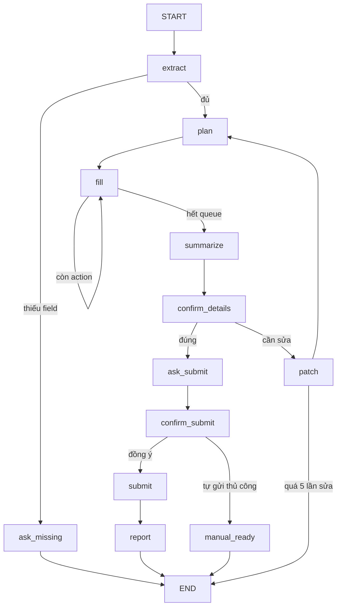

# PROMPT: Xây dựng lại dự án "VinFast Electric Showcase + AI Copilot điền form lái thử"

> File này là prompt hoàn chỉnh để giao cho một AI agent dựng lại toàn bộ dự án từ đầu.
> Phạm vi: `src/` và các file cấu hình ở root. Không bao gồm phần logging của BTC
> (`.ai-log/`, hook trong `.claude/settings.json`) và các skill hỗ trợ.

---

## 1. Bối cảnh & mục tiêu

Xây dựng một web demo showroom xe điện VinFast tại Hà Nội gồm 3 phần:

1. **Trang khách hàng** (`/`): landing page giới thiệu xe điện, có form đăng ký lái thử.
2. **AI Copilot** (chat popup góc màn hình): khách nhắn tin tự nhiên tiếng Việt ("Tôi là Nam, 0912345678, muốn lái thử VF 8 sáng mai ở Cầu Giấy"), agent bóc thông tin, **tự mở form và di một con trỏ ảo trên màn hình điền từng ô như người thật**, tóm tắt lại, xin xác nhận 2 bước (đúng thông tin chưa → có cho tự gửi không) rồi mới submit.
3. **Admin Portal / CRM** (`/admin-portal`): nhân viên kinh doanh đăng nhập, xem danh sách khách đăng ký, tìm kiếm, lọc theo trạng thái, đổi trạng thái chăm sóc.

Toàn bộ UI, thông báo lỗi, tin nhắn của agent đều bằng **tiếng Việt**.

## 2. Tech stack (chốt cứng, không thay đổi)

**Backend:** Python 3.11, FastAPI + uvicorn, LangGraph (checkpointer `MemorySaver`), `langchain-openai` (model mặc định `gpt-4o-mini`), thư viện `ag_ui_langgraph` để phơi graph theo giao thức AG-UI, SQLAlchemy 2.0 + SQLite, pydantic v2 + pydantic-settings, pytest + pytest-asyncio + httpx, ruff.

**Frontend:** Vite + React (JSX thuần, không TypeScript), TailwindCSS 3.4, `@copilotkit/react-core` + `@copilotkit/react-ui` ^1.63, `@ag-ui/client` (HttpAgent), framer-motion, lucide-react. **Quy ước đặt tên frontend: snake_case cho biến/hàm/props** (ví dụ `set_form_data`, `on_ward_change`).

**Hạ tầng:** docker-compose 2 service — `backend` (port 8000, volume `./data` giữ SQLite qua các lần rebuild, healthcheck gọi `/health`) và `frontend` (nginx, map `5173:80`, `depends_on: condition: service_healthy`).

## 3. Cấu trúc thư mục

```
src/backend/
  main.py  config.py  Dockerfile
  api/routes.py
  agents/{state.py, form_graph.py, graph.py, catalog.py, wards.py}
  agents/nodes/form_nodes.py
  models/schemas.py
  services/{database.py, tables.py, customer_repository.py, security.py, llm.py}
src/frontend/
  index.html  vite.config.js  tailwind.config.js  nginx.conf  Dockerfile
  src/{main.jsx, App.jsx, index.css}
  src/components/{Navbar, Hero, FilterBar, VehicleGrid, VehicleCard, AccessorySection,
    AccessoryCard, Footer, TestDriveModal, WardSelect, AdminPortal,
    AgentCursor, AgentApprovalCard, ChatAutoHide}.jsx
  src/data/{vehicles.js, accessories.js, hanoi_wards.js}
  src/lib/{api.js, formatDate.js, formatPrice.js, useAgentCursor.js, useAgentActionRunner.js}
tests/{test_api/, test_agents/}
docker-compose.yml  requirements.txt  .env.example  ruff.toml
```

## 4. Backend

### 4.1 Dữ liệu & cấu hình

- `config.py`: `Settings(BaseSettings)` đọc `.env` — `openai_api_key`, `model_name=gpt-4o-mini`, `llm_temperature`, `database_url=sqlite:///./data/app.db`, `cors_origins` (chuỗi phân tách bằng dấu phẩy), cache bằng `@lru_cache`.
- `services/tables.py`: 2 bảng SQLAlchemy:
  - `SalesStaff`: id, name, initials, email (unique), phone, password_hash, is_active, quan hệ 1-n với Customer.
  - `Customer`: id, `code` (dạng `VF-{24081+id}`, sinh sau `flush()`), name, phone, email nullable, vehicle_id, model, test_drive_date, test_drive_time, province (mặc định "Hà Nội"), ward, address_detail, note, marketing_opt_in, status (mặc định "Mới"), source (mặc định "Website"), sales_staff_id nullable, created_at.
- `services/database.py`: `init_db()` idempotent — tự tạo thư mục SQLite, `create_all`, seed 3 nhân viên demo (`lan.anh@vinfast.vn` / `LanAnh@2026`, `minh.quan@…` / `MinhQuan@2026`, `thanh.ha@…` / `ThanhHa@2026`). **Không** seed khách hàng mẫu lúc khởi động (bảng khách phải trống cho tới khi có đăng ký thật; hàm `seed_demo_customers` chỉ chạy khi bảng hoàn toàn trống, dùng cho demo thủ công).
- `services/security.py`: băm mật khẩu PBKDF2-SHA256 260.000 vòng bằng `hashlib` thuần (không thêm dependency), chuỗi lưu dạng `pbkdf2_sha256$vòng$muối$băm`, so khớp bằng `hmac.compare_digest`.

### 4.2 Schemas (pydantic)

- `TestDriveCreate`: name, phone (chỉ chữ số, ≥10), email optional (chuỗi rỗng quy về None), vehicle_id, model, test_drive_date (không được quá khứ), test_drive_time thuộc `TIME_SLOTS = ("08:00","09:30","11:00","13:30","15:00","16:30")`, province chỉ nhận "Hà Nội", ward, note optional, status thuộc `{"Mới","Đã liên hệ","Đặt lịch","Không phù hợp"}`, source thuộc `{"Website","Facebook","Showroom","Zalo"}`.
- `SalesStaffOut` **cố tình không có** `password_hash`. `CustomerOut` nhúng `sales_staff` lồng nhau.

### 4.3 API (`/api/v1`)

| Endpoint | Hành vi |
|---|---|
| `POST /auth/login` | So email+mật khẩu; sai trả 401 với một thông báo chung (không tiết lộ email nào tồn tại) |
| `POST /test-drives` | Tạo đăng ký từ form công khai, trả 201 + CustomerOut |
| `GET /customers?search=&status=` | Tìm theo code/name/phone/model/ward/province (ilike), lọc status, sort created_at desc |
| `PATCH /customers/{code}/status` | Đổi trạng thái theo mã hiển thị, 404 nếu không thấy |
| `GET /sales-staff` | Danh sách nhân viên |
| `GET /health` | `{"status":"ok"}` |

Ngoài ra `main.py` có exception handler dịch lỗi validation của FastAPI sang tiếng Việt ("Field required" → "Trường này là bắt buộc."…).

### 4.4 Agent LangGraph (trọng tâm)

**State** (`AgentState` — **bắt buộc dùng `TypedDict` của `typing_extensions`**, không phải `typing`: Python 3.11 trong container sẽ vỡ `get_input_jsonschema()` của ag-ui-langgraph nếu dùng `typing.TypedDict`): `messages` (Annotated add_messages), `draft`, `missing_fields`, `action_queue`, `current_action`, `filled_fields`, `run_seq`, `run_kind` ("full"|"correction"), `awaiting`, `changed_fields`, `correction_rounds`, `submission_code`, `status`, `query`, `response`, `error`.

**Graph:**



Hành vi từng node:

- **extract**: lấy câu user mới nhất (đọc cả `messages` lẫn `query` để test gọi trực tiếp được), gọi LLM `with_structured_output(ExtractedDraft)` với prompt nêu rõ: chỉ điền field khách thực sự nói, không bịa; email không bắt buộc; ngày tương đối ("mai", "thứ 5 tuần sau") quy về YYYY-MM-DD (prompt kèm ngày hôm nay + thứ); giờ phải map về khung gần nhất trong TIME_SLOTS ("9 rưỡi" → 09:30); số sau "vào/lúc" là giờ chứ không phải ngày; ghi nhận "yêu cầu khác" vào note nhưng không tự hứa hẹn. Kết quả được chuẩn hoá qua catalog (mục 4.5) và **gộp lên draft cũ** — trừ khi lượt trước đã kết thúc (`status ∈ {done, manual_ready, error}`) thì bắt đầu draft mới sạch để không lộ dữ liệu khách trước.
- **ask_missing**: hỏi gộp một lần tất cả field bắt buộc còn thiếu (name, phone, vehicle_id, date, time, ward — email và note là optional).
- **plan**: dựng `action_queue` — mỗi field một action `{type, field, label, selector: "[data-agent-field=…]", value, run_seq}`; type là `type` cho name/phone/email/note, `select` cho vehicle_id/date/time, `pick_ward` cho ward. `run_seq` tăng mỗi lượt và **đóng dấu lên từng action** (để frontend phân biệt 2 lượt, tránh bộ lọc chống trùng nuốt action). Nếu là lượt sửa (`changed_fields` khác rỗng) chỉ dựng action cho field đã đổi, `run_kind="correction"`.
- **fill**: node tự lặp, **mỗi vòng pop đúng 1 action** ra `current_action` kèm `await asyncio.sleep(0.7)` — nhờ đó mỗi vòng là một state-delta riêng được stream ra frontend, con trỏ chạy từng ô thay vì nhảy phát cuối.
- **summarize**: đọc lại toàn bộ draft dạng gạch đầu dòng, hỏi khách xác nhận.
- **confirm_details** và **confirm_submit**: gọi `interrupt()` của LangGraph — graph đóng băng, checkpointer giữ state, frontend resume bằng cùng `thread_id`. Phân loại trả lời bằng từ khoá (AFFIRMATIVE: "xác nhận", "đồng ý", "ok", "chốt"…; NEGATIVE: "không", "chưa", "tự gửi") — không tốn lượt LLM.
- **patch**: giới hạn 5 vòng sửa (quá thì báo gọi hotline 1900 23 23 89 và dừng với `error`). Gọi LLM bóc lại câu sửa, nhưng **chỉ áp kết quả LLM cho những field khách thực sự nhắc tới** (đoán bằng regex/từ khoá không dấu: giờ, ngày, sđt, email, mẫu xe, phường, note, tên), đồng thời ưu tiên bắt trực tiếp các giá trị định dạng cứng bằng regex (HH:MM ∈ TIME_SLOTS, YYYY-MM-DD ≥ hôm nay, số điện thoại, tên xe, tên phường duy nhất) để không phụ thuộc hoàn toàn LLM. Tính `changed_fields = field có giá trị khác trước`.
- **submit**: dựng `TestDriveCreate` từ draft và ghi qua **đúng repository mà form thủ công dùng**; sinh `submission_code`. **manual_ready**: giữ nguyên form, không tạo bản ghi, nhắn khách tự bấm nút. **report**: báo mã đăng ký + lịch hẹn + hotline.

Mọi câu agent nói phải phát qua `messages` (AIMessage) — field `response` không hiển thị trong khung chat.

### 4.5 Catalog chuẩn hoá tiếng Việt (`catalog.py`, `wards.py`)

- Danh mục 14 xe `(vehicle_id, tên)`: vf2, vf3, vf5, vf6, vf7, vf8, vf8-allnew "VF 8 All New (2026)", vfmpv7 "VF MPV 7", vf9, minio-green, herio-green, nerio-green, limo-green, ec-van — **phải khớp `vehicles.js` phía frontend** (viết test đọc thẳng file JS để so sánh).
- `strip_accents` (bỏ dấu, đổi đ→d), `match_vehicle` ("con VF8", "vf 9" → id; khớp một phần chỉ nhận khi duy nhất 1 ứng viên), `match_ward` trên danh mục **127 phường/xã Hà Nội** (khớp tuyệt đối; bỏ tiền tố "Phường/Xã"; nhiều ứng viên → trả None, agent không đoán bừa), `normalize_phone` (bỏ ký tự lạ, +84 → 0).

### 4.6 Điểm nối AG-UI (bẫy quan trọng)

Trong `main.py`, phơi agent bằng `add_langgraph_fastapi_endpoint(app, LangGraphAgent(name="test_drive_agent", graph=form_agent), "/agent/test-drive")`. **KHÔNG dùng `CopilotKitRemoteEndpoint`** — endpoint đó nói giao thức remote-endpoint v1 cần một CopilotKit Runtime Node đứng giữa, còn `@copilotkit/react-core` 1.63 trên trình duyệt nói v2; nối thẳng AG-UI thì bỏ được tiến trình Node trung gian.

## 5. Frontend

### 5.1 Khung app

- `main.jsx`: bọc `<CopilotKit agents__unsafe_dev_only={{test_drive_agent: new HttpAgent({url: VITE_AGENT_URL ?? 'http://localhost:8000/agent/test-drive'})}} agent="test_drive_agent" showDevConsole={false}>`.
- `App.jsx`: nếu `pathname === '/admin-portal'` render `<AdminPortal/>`, ngược lại là trang showcase: Navbar → Hero → FilterBar (lọc segment, dòng xe personal/service, sort giá) → VehicleGrid → AccessorySection → Footer → TestDriveModal → AgentCursor → CopilotPopup.
- **State form được nâng lên App** để người dùng và agent cùng ghi một chỗ: `form_data`, `selected_vehicle_id` (mặc định `vf8`), `ward_notice`.
- Đọc state agent bằng `useCoAgent({name:'test_drive_agent', initialState:{draft:{}, status:'idle', current_action:null}})`. Khi `status==='filling'` tự mở modal. Khi sang `run_seq` mới với `run_kind==='full'` thì reset form (lượt `correction` giữ nguyên). Chỉ cất con trỏ + mở lại chat khi **hàng đợi animation frontend chạy xong** (backend có thể sang trạng thái confirming sớm hơn animation).
- `useLangGraphInterrupt` bắt 2 interrupt `confirm_details`/`confirm_submit`, render `AgentApprovalCard` ngay trong khung chat: thẻ confirm_details có nút "Thông tin chính xác" + textarea gửi yêu cầu sửa; thẻ confirm_submit có 2 nút "Tự động gửi" / "Tôi tự gửi" — resolve bằng chuỗi tiếng Việt tương ứng.
- `ChatAutoHide` (con của CopilotPopup, dùng `useChatContext().setOpen`): thu gọn chat khi agent đang điền để lộ con trỏ, **luôn mở lại khi xong** (thẻ xác nhận nằm trong chat, đóng thì graph đứng mãi ở interrupt). `clickOutsideToClose={false}`.

### 5.2 Con trỏ ảo (điểm nhấn của demo)

- `AgentCursor.jsx`: overlay `fixed`, `pointer-events-none`, z-200, transition transform 500ms; icon mũi tên (đổi thành I-beam khi trỏ vào ô nhập chữ), vòng ping khi click, nhãn tên ô đang điền cạnh con trỏ.
- `useAgentCursor.js`: `move_to(element, label)` (scrollIntoView, tính toạ độ từ `getBoundingClientRect`, chờ 500ms), `click(element)` (focus thật để caret nhấp nháy, flash 200ms), `hide()`. **`controls` phải bọc `useMemo` giữ nguyên tham chiếu qua mọi render** — nếu không, effect của action runner chạy lại giữa chừng và huỷ animation đang dở. Kèm helpers `sleep`, `next_frame` (double rAF), `wait_for_element(selector, timeout)` (poll theo frame — cần vì modal mở bằng setState nên phần tử chưa chắc đã render khi action tới).
- `useAgentActionRunner.js`: nhận `current_action` stream từ backend, gom vào **FIFO một worker duy nhất**, chống trùng bằng chữ ký `run_seq:type:field:value`, reset queue khi `run_seq` đổi, dùng `generation_ref` để an toàn với StrictMode/unmount. Ô `type`: move → click → **gõ dần từng ký tự 45ms/ký tự**. Ô `select`: move → click → set giá trị. Ô `pick_ward` nở thành chuỗi: mở dropdown qua ref → move tới ô search → gõ dần đủ tên phường → đếm kết quả lọc; **nếu khác đúng 1 kết quả thì không click bừa** — đóng dropdown và gọi `on_ward_needs_user` để hiện thông báo nhờ khách tự chọn.
- Mọi ô trong form gắn `data-agent-field="name|phone|email|vehicle_id|test_drive_date|test_drive_time|note"`; WardSelect có `data-agent-ward-search` và `data-agent-ward-option="<tên>"`, và expose imperative ref `{open, close, search, get_filtered, pick}`.

### 5.3 TestDriveModal

2 cột: trái là panel gradient thương hiệu hiện ảnh + tên mẫu xe đang chọn (đồng bộ với dropdown), phải là form: họ tên\*, sđt\* (pattern ≥10 số), email (không bắt buộc), mẫu xe\* (select), ngày\* (input date, `min` = hôm nay), giờ\* (select 6 khung), tỉnh thành readonly "Hà Nội", phường/xã\* (WardSelect searchable), textarea "Yêu cầu khác". Submit gọi `POST /api/v1/test-drives`; thành công hiện màn hình chúc mừng + mã `VF-xxxxx` + hotline. Khi agent submit hộ (`agent_submission_code` từ state agent), modal cũng chuyển sang màn thành công y hệt. `run_seq` mới dạng full thì reset trạng thái submitted để một phiên chat phục vụ nhiều khách liên tiếp.

### 5.4 AdminPortal

Login (email + mật khẩu, lưu `sessionStorage`) → dashboard CRM: sidebar, ô search + lọc trạng thái, bảng khách hàng (code, tên, xe, lịch hẹn, nguồn, nhân viên phụ trách theo initials, badge trạng thái 4 màu), panel chi tiết trượt từ phải cho phép đổi trạng thái bằng các nút bấm. Dữ liệu lấy từ API thật.

### 5.5 Dữ liệu tĩnh

`vehicles.js`: 14 xe với id/name/segment/seats/range/priceFrom/priceList/line ("personal"|"service") + ảnh Unsplash. `hanoi_wards.js`: 127 phường/xã (là **nguồn sự thật**, bản Python sinh lại từ đây). `accessories.js`: vài phụ kiện trưng bày.

## 6. Docker & nginx

- Backend Dockerfile: Python 3.11-slim, chạy uvicorn. Compose ghi đè `DATABASE_URL=sqlite:////app/data/app.db` trỏ vào volume.
- Frontend: build Vite multi-stage → nginx. `VITE_API_URL=""` (cùng origin) và `VITE_AGENT_URL="/agent/test-drive"` truyền qua **build args** (Vite nhúng cứng lúc build). nginx: SPA fallback `try_files … /index.html` (để `/admin-portal` không 404), proxy `/api/` sang `backend:8000`, và proxy `/agent/` với **`proxy_buffering off` + `chunked_transfer_encoding off` + read_timeout 300s** — thiếu dòng này thì stream AG-UI bị nginx gom lại, chat đứng im rồi hiện ra một cục.

## 7. Kiểm thử & nghiệm thu

- Chạy: `uvicorn src.backend.main:app --reload --port 8000` + `npm run dev` trong `src/frontend`, hoặc `docker compose up --build`. Lint/test: `ruff check`, `pytest tests/ -v`.
- Test tối thiểu:
  1. **test_catalog** — đọc `vehicles.js`/`hanoi_wards.js` và so với bản Python để hai danh mục không lệch nhau.
  2. **test_form_nodes** với mock LLM — extract thiếu field → ask_missing, đủ field → plan/fill đủ action đúng thứ tự `name→phone→email→vehicle_id→date→time→ward`, patch chỉ đổi field được nhắc, quá 5 vòng sửa thì dừng.
  3. **test_api routes** — login sai trả 401, tạo test-drive sinh code, lọc customers.
- Kịch bản nghiệm thu end-to-end: nhắn "Tôi là Trần Văn A, 0987654321, muốn lái thử VF 8 lúc 9 rưỡi sáng mai ở Hoàn Kiếm" → agent mở form, con trỏ điền lần lượt từng ô (ward gõ trong dropdown rồi click), tóm tắt, hiện thẻ xác nhận; bấm sửa "đổi giờ thành 15:00" → con trỏ chỉ quay lại ô giờ; xác nhận → hỏi quyền gửi → "Tự động gửi" → màn hình thành công hiện mã VF-xxxxx và bản ghi xuất hiện trong Admin Portal với trạng thái "Mới".

---

## Phụ lục: 5 bẫy kỹ thuật bắt buộc giữ lại

Đây là những chi tiết mà bản gốc phải trả giá mới tìm ra. Thiếu chúng thì bản tái tạo gần như chắc chắn dựng lại đúng các lỗi cũ.

| # | Bẫy | Hậu quả nếu bỏ |
|---|---|---|
| 1 | `AgentState` phải là `TypedDict` của `typing_extensions` | Container Python 3.11 chết ngay ở request đầu (`get_input_jsonschema()` vỡ), máy dev 3.12 không lộ lỗi |
| 2 | Nối thẳng AG-UI, không dùng `CopilotKitRemoteEndpoint` | Trình duyệt (react-core v2) không đọc được endpoint v1 |
| 3 | `controls` của cursor phải ổn định tham chiếu (`useMemo`) | Effect chạy lại giữa animation, con trỏ di chuyển nhưng không bao giờ điền |
| 4 | `run_seq` đóng dấu lên từng action | Lượt sau trùng chữ ký lượt trước, bị bộ lọc chống lặp chặn — form không được điền lại |
| 5 | nginx `proxy_buffering off` cho `/agent/` | Chat đứng im vài giây rồi trả cả câu một lượt, mất hiệu ứng stream |
