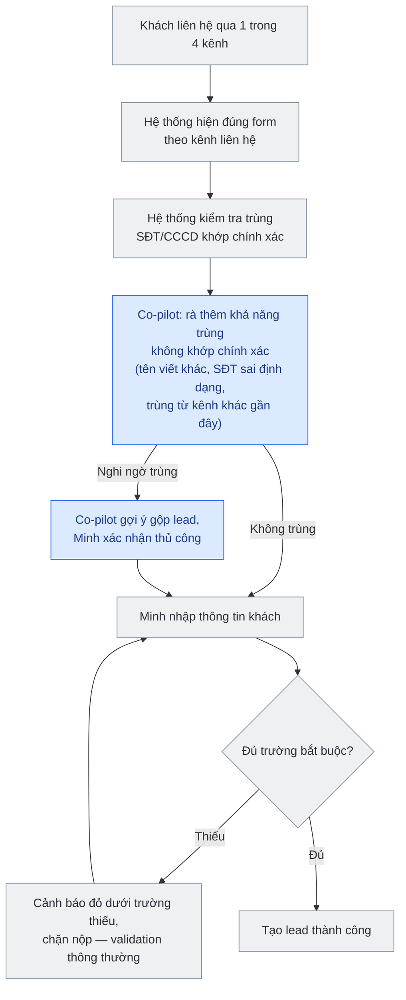
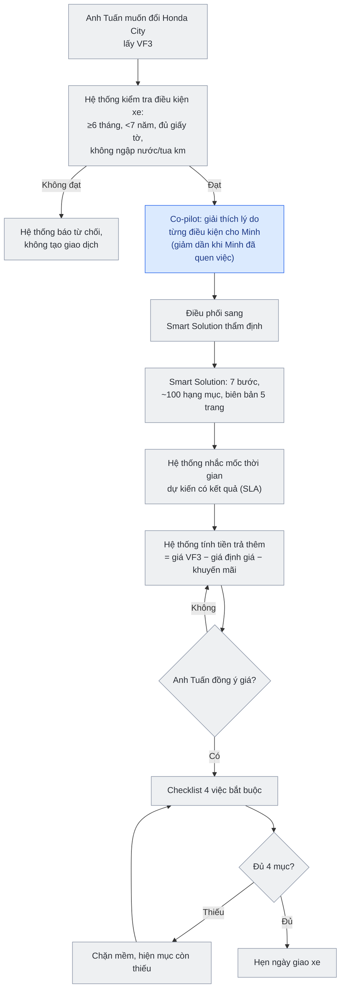
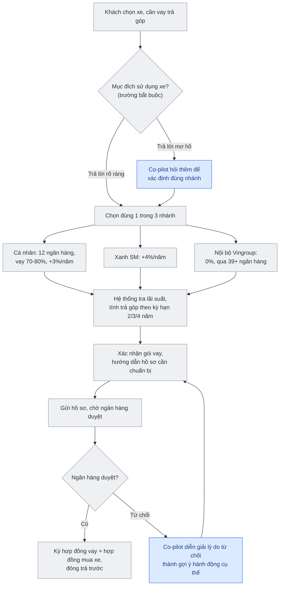
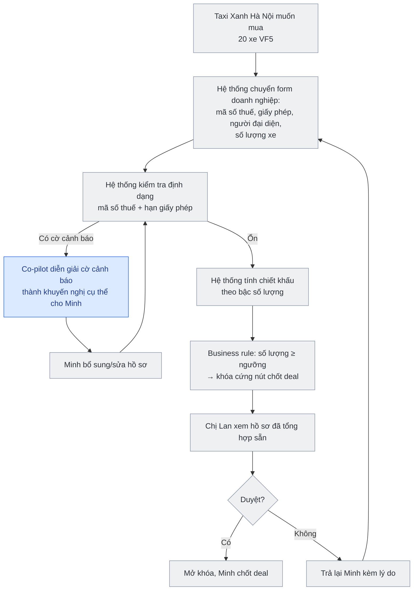
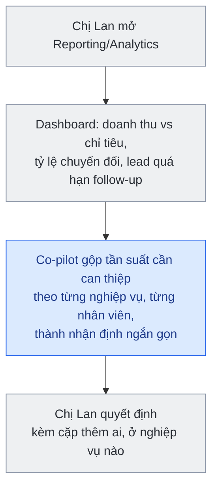
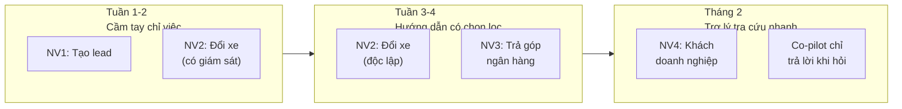

# VinFast AI Co-pilot — User Journey Onboarding (Bản rà soát lại)

**Phiên bản:** 5.0
**Ví dụ xuyên suốt:** Minh (Sales mới), anh Tuấn (đổi xe), chị Hoa / anh Nam / chị Mai (vay ngân hàng), công ty Taxi Xanh Hà Nội (khách doanh nghiệp), chị Lan (Sales Manager)

---

## 0. Nguyên tắc quan trọng nhất của bản này

Ở bản trước, nhiều bước được gán cho "Co-pilot" trong khi thực chất chỉ là tính năng phần mềm thông thường — không cần AI. Ví dụ điển hình: nghiệp vụ 1 có bước "Co-pilot đánh dấu trường bắt buộc còn thiếu, không cho submit" — đây thực ra chỉ là **validation form**: thiếu trường thì hiện cảnh báo đỏ ngay dưới ô đó, không cho nộp. Việc này không cần agent, không cần AI, chỉ cần code kiểm tra input. Bản này bỏ cách gán nhầm đó và áp dụng một nguyên tắc xuyên suốt:

> **Chỉ gọi là "Co-pilot AI" khi việc đó cần diễn giải ngôn ngữ tự nhiên, cá nhân hóa theo từng nhân viên, hoặc xử lý tình huống không có luật cứng rõ ràng. Mọi thứ có thể giải quyết bằng validation, business rule, hoặc dashboard thông thường thì không cần AI — rẻ hơn, ổn định hơn, dễ bảo trì hơn.**

Trong mỗi nghiệp vụ dưới đây, sơ đồ dùng 2 màu:
- **Ô xám** = tính năng hệ thống thông thường (rule/validation/workflow gate/dashboard — không cần AI)
- **Ô xanh** = chỗ Co-pilot AI thực sự tạo giá trị

Có nghiệp vụ (như nghiệp vụ 4) phần lớn chỉ cần hệ thống thông thường, AI chỉ đóng góp rất ít — đó là kết luận thực tế, không phải thiếu sót.

---

## 1. Nghiệp vụ 1 — Tạo lead

**Ví dụ:** Anh Tuấn gọi điện hỏi mua VF3. Minh mở CRM tạo khách mới.

**Tính năng hệ thống (không cần AI):**
- Nhận diện kênh liên hệ (cửa hàng/điện thoại/web/sự kiện) → tự hiện đúng form, đúng trường cần nhập theo kênh đó
- Kiểm tra trùng theo số điện thoại/CCCD khớp chính xác với dữ liệu đã có
- Trường bắt buộc còn thiếu → **hiện cảnh báo đỏ ngay dưới trường đó, chặn nộp** — đây là validation cơ bản, không cần agent

**Co-pilot AI thực sự cần:**
- Bắt các trường hợp trùng mà so khớp chính xác bỏ sót: anh Tuấn để lại thông tin trên web tuần trước với tên viết khác ("Tuấn Nguyễn" thay vì "Nguyễn Văn Tuấn"), hoặc số điện thoại nhập thiếu số 0 đầu. Đây là bài toán so khớp mờ (fuzzy matching), có thể dùng thuật toán so khớp đơn giản chứ không cần mô hình ngôn ngữ lớn — nhưng vẫn cần một lớp "phán đoán" ngoài rule khớp tuyệt đối. Co-pilot chỉ **gợi ý gộp**, Minh xác nhận, không tự động gộp.

---

## 2. Nghiệp vụ 2 — Đổi xe cũ lấy xe mới

**Ví dụ:** Anh Tuấn muốn đổi Honda City 2019 lấy VF3. Đây là lần đầu Minh gặp tình huống này.

**Tính năng hệ thống (không cần AI):**
- Kiểm tra điều kiện xe theo tiêu chí cứng: sở hữu ≥ 6 tháng, dưới 7 năm sử dụng, đủ giấy tờ gốc, không đâm đụng kết cấu/ngập nước/tua km — đây là rule check dựa trên dữ liệu đã nhập, kết quả đúng/sai rõ ràng
- Checklist 4 việc bắt buộc (hợp đồng, đặt cọc, giấy tờ xe cũ, cập nhật trạng thái) trước khi cho qua bước hẹn giao xe — workflow gate thông thường
- Công thức tính tiền trả thêm = giá xe mới − giá định giá xe cũ − khuyến mãi — chỉ cần dữ liệu đúng, không cần AI
- Nhắc mốc thời gian dự kiến nhận kết quả từ Smart Solution — đây là timer/thông báo tự động dựa trên SLA đã biết trước, không cần phán đoán

**Co-pilot AI thực sự cần:**
- Với Minh — người lần đầu gặp tình huống — giải thích bằng lời **vì sao** từng điều kiện quan trọng (không chỉ hiện "đạt/không đạt" mà giải thích ngữ cảnh, ví dụ vì sao xe ngập nước bị loại). Mức độ giải thích giảm dần khi Minh đã xử lý quen tay — đây là cá nhân hóa theo lịch sử thao tác từng nhân viên, khó làm bằng rule tĩnh.

Ghi chú thực tế: từng có trường hợp khách đặt cọc nhưng việc thu xe cũ chưa kịp xử lý, khách phải chờ không rõ lý do. Vì đây là vấn đề SLA/tích hợp dữ liệu giữa 2 hệ thống (VinFast và Smart Solution), cách xử lý đúng là đảm bảo webhook cập nhật đúng hạn, không phải thêm AI để "phát hiện" — AI không giải quyết được lỗi tích hợp hệ thống.

---

## 3. Nghiệp vụ 3 — So sánh gói trả góp ngân hàng

**Ví dụ:** Chị Hoa mua VF5, cần vay. Anh Nam cũng mua VF5 nhưng để chạy Xanh SM. Chị Mai là nhân viên Vingroup.

**Tính năng hệ thống (không cần AI):**
- "Mục đích sử dụng xe" là **trường bắt buộc chọn trước** khi được phép qua bước so sánh gói vay — giống nguyên tắc ở nghiệp vụ 1, đây chỉ là làm cho trường này bắt buộc trong form, không cần AI để "nhắc"
- Tra lãi suất/hạn mức theo nhánh đã chọn, tính trả góp theo kỳ hạn 2/3/4 năm — data lookup + công thức tài chính chuẩn
- Xác nhận lại thông tin gói vay với khách, liệt kê giấy tờ cần chuẩn bị — hiển thị thông tin có sẵn

**Co-pilot AI thực sự cần:**
- Khi khách trả lời mơ hồ (chị Hoa nói: "thỉnh thoảng em cũng chở khách kiếm thêm") — Co-pilot hỏi thêm để xác định đúng nhánh, tránh Minh tự đoán và chọn nhầm nhánh cá nhân trong khi đáng lẽ là nhánh Xanh SM (khác biệt 3%/năm so với 4%/năm, ảnh hưởng tiền thật của khách)
- Khi ngân hàng từ chối hồ sơ, diễn giải lý do từ chối thành gợi ý hành động cụ thể bằng ngôn ngữ dễ hiểu cho Minh (ví dụ: "hồ sơ chị Hoa bị từ chối do thu nhập chưa đủ so với mức vay — có thể thử kỳ hạn dài hơn để giảm số tiền trả hàng tháng, thay vì đổi ngân hàng khác") — đây có thể bắt đầu bằng bảng ánh xạ lý do → gợi ý, không cần suy luận phức tạp, nhưng việc *diễn giải thành lời khuyên rõ ràng* vẫn là giá trị của Co-pilot so với chỉ hiện mã lỗi từ ngân hàng

---

## 4. Nghiệp vụ 4 — Khách hàng doanh nghiệp

**Ví dụ:** Công ty Taxi Xanh Hà Nội muốn mua 20 xe VF5.

**Tính năng hệ thống (không cần AI):**
- Nhận diện khách hàng loại doanh nghiệp → chuyển sang form nhập: mã số thuế, giấy phép kinh doanh, người đại diện, số lượng xe
- Tính chiết khấu theo bậc số lượng — công thức cố định
- Kiểm tra định dạng mã số thuế, hạn còn hiệu lực của giấy phép kinh doanh — validation dữ liệu thông thường, giống hệt nguyên tắc "cảnh báo đỏ" ở nghiệp vụ 1
- Business rule: số lượng xe ≥ ngưỡng → khóa cứng nút "chốt deal" cho tới khi Sales Manager duyệt — workflow gate, không cần AI để "nhận diện", chỉ cần so sánh số lượng với ngưỡng đã định nghĩa sẵn

**Co-pilot AI thực sự cần:**
- Rất ít trong nghiệp vụ này. Điểm duy nhất đáng kể: khi hệ thống phát hiện cờ cảnh báo (giấy phép sắp hết hạn trong 2 tuần, mã số thuế sai định dạng), Co-pilot diễn giải thành khuyến nghị hành động cụ thể cho Minh bằng lời thay vì chỉ hiện mã lỗi — ví dụ: "Giấy phép kinh doanh của Taxi Xanh Hà Nội hết hạn trong 2 tuần nữa, nên hỏi khách bổ sung bản gia hạn trước khi hồ sơ lên chị Lan duyệt, tránh bị trả lại."

Đây là ví dụ rõ nhất cho nguyên tắc ở mục 0: gần như toàn bộ nghiệp vụ 4 chỉ cần hệ thống thông thường làm tốt; Co-pilot chỉ cần thiết ở phần biến một cảnh báo dữ liệu thành lời khuyên dễ hành động.

---

## 5. Nghiệp vụ 5 — Theo dõi hiệu suất đội sales

**Ví dụ:** Đầu tuần, chị Lan mở màn hình báo cáo.

**Tính năng hệ thống (không cần AI):**
- Doanh thu đội so với chỉ tiêu tháng, tỷ lệ lead chuyển thành hợp đồng, danh sách khách chưa liên hệ lại quá lâu — đây là dashboard/report chuẩn, tính toán từ dữ liệu có sẵn

**Co-pilot AI thực sự cần:**
- Gộp nhiều tín hiệu rời rạc (tần suất Minh cần được nhắc/cảnh báo ở từng nghiệp vụ, theo thời gian) thành một nhận định ngắn gọn, dễ hành động: "Minh đang ổn ở nghiệp vụ 1-2, nhưng vẫn hay cần nhắc ở nghiệp vụ 3 (phân nhánh vay) — nên kèm thêm." Đây là việc diễn giải dữ liệu thành câu nhận định có ngữ cảnh, khác với một con số đơn lẻ trên dashboard.

---

## 6. Hành trình tổng thể của Minh (2 tháng)

Ghi chú thực tế/tối ưu: "giảm dần mức hướng dẫn" không cần mô hình học máy phức tạp — có thể bắt đầu bằng một quy tắc đơn giản, ví dụ đếm số lần Minh cần Co-pilot nhắc trong N giao dịch gần nhất; nếu dưới ngưỡng thì tự giảm mức "cầm tay". Nên bắt đầu từ heuristic đơn giản, chỉ nâng cấp lên mô hình phức tạp hơn nếu heuristic không đủ tốt.

---

## 7. Bảng tổng hợp: nghiệp vụ nào thực sự cần AI đến đâu

| Nghiệp vụ | Actor chính | Mức độ cần AI | Vai trò AI (nếu có) |
|---|---|---|---|
| 1. Tạo lead | Sales | Thấp | Bắt trùng lead không khớp chính xác |
| 2. Đổi xe | Sales, Smart Solution | Trung bình | Giải thích lý do + cá nhân hóa mức hướng dẫn |
| 3. Trả góp | Sales, Ngân hàng | Cao nhất | Làm rõ nhánh chính sách mơ hồ, diễn giải lý do từ chối |
| 4. Doanh nghiệp | Sales, Sales Manager | Rất thấp | Diễn giải cờ cảnh báo hồ sơ thành khuyến nghị |
| 5. Theo dõi hiệu suất | Sales Manager | Trung bình | Gộp tín hiệu thành nhận định có ngữ cảnh |

---

## 8. Yêu cầu tích hợp hệ thống

VinFast đang vận hành Salesforce CRM + SAP ERP — Co-pilot nên thiết kế như lớp overlay trên Salesforce, không phải hệ thống độc lập. Ba nguồn dữ liệu ngoài cần xác nhận API/luồng cập nhật:

1. **Smart Solution:** webhook kết quả thẩm định xe cũ, kèm SLA thời gian xử lý để hệ thống tự nhắc (không cần AI)
2. **Financing Partner:** API lãi suất/hạn mức của 12+ ngân hàng theo 3 nhánh chính sách
3. **Promotion/Policy:** một nguồn dữ liệu policy duy nhất có versioning theo thời gian hiệu lực

## 9. Rủi ro & câu hỏi cần làm rõ trước khi triển khai

| Câu hỏi | Vì sao quan trọng |
|---|---|
| Ranh giới "practice mode" (sandbox) cho Sales | Tránh luyện tập làm hỏng lead/hợp đồng thật |
| Mức độ chặn ở nghiệp vụ 4 (chị Lan mong muốn chặn cứng đến đâu) | Ảnh hưởng trực tiếp trải nghiệm Sales |
| Sales Manager phân ca thủ công hay hệ thống tự động | Quyết định actor đúng cho module Employee/Shift |
| Quy trình nghiệp vụ 4 cụ thể ngoài chính sách Xanh SM/GSM | Chưa có dữ liệu công khai, cần hỏi trực tiếp đội sales doanh nghiệp |
| API/webhook thực tế từ Smart Solution và các ngân hàng | Quyết định phần "tra cứu tức thời" có thật hay chỉ dựa dữ liệu nhập tay |
| Ngưỡng cụ thể để bật/tắt mức hướng dẫn (progressive autonomy) | Cần số liệu thực tế từ vài tuần đầu để hiệu chỉnh, không nên đoán trước |
